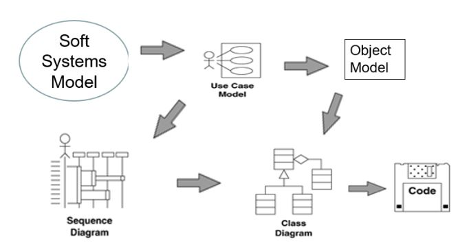
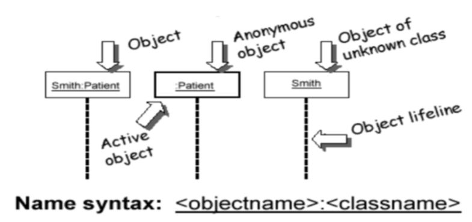
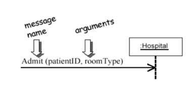
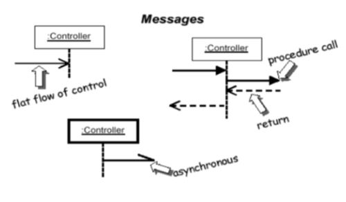
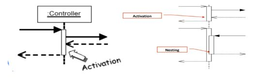

### Theory

**Object Oriented Design**

* Design helps in specifying the structure of how a software system will be written and function, without writing the complete implementation.
* It is a transition from "what" the system must do, to "how" the system will do it,
* Designing Classes:
    * class identification from project spec / requirements 
        * nouns are potential classes, objects, fields 
        * verbs are potential methods or responsibilities of a class
    * Use Unified Modelling Language(UML) to represent the classes and objects
        * UML is an open standard; lots of companies use it 
        * UML is a descriptive language: rigid formal syntax (like programming) 
        * UML is a prescriptive language: shaped by usage and convention 
        * it's okay to omit things from UML diagrams if they aren't needed by team/supervisor/instructor
* Beginning of software system design is depicted in the following picture:




**Time Sequence**

* It describes the flow of messages, events, actions between objects. 
* It shows concurrent processes and activations. 
* It shows time sequences that are not easily depicted in other diagrams.
* It is typically used during analysis and design to document and understand the logical flow of your system


```
Sequence diagram emphasized on time ordering!

```

* Sequence Diagram Key Parts:
    * participant: an object or entity that acts in the sequence diagram.
    * message: communication between participant objects
        * Messages
            * The name of the service requested by the calling object.
            * Copies of the information required to execute the service and the name of a holder for the result of the service.
        * In practice, messages are often implemented by procedure calls.
            * Name = procedure name.
            * Information = parameter list.
    
    * the axes in a sequence diagram:
        * horizontal: which object/participant is acting.
            * X-axis is objects.
                * Object that initiates interaction is left most
                * Object to the right are increasingly more subordinate<br> 

        * vertical: time (down implies forward in time)
            * Y-axis is time
                * Messages sent and received are ordered by time.<br>  <br> 
                * Activation (double line) is the execution of the procedure<br>  
                * Object lifelines represent the existence over a period of time

* Steps for Building a Sequence Diagram

    * Identify which objects and actors will participate.
        * Set the lifeline for each object/actor.
    * Identify the messages from the use case.
        * They are the verb phrases in the use case.
    * Lay out the messages from the top to the bottom of the diagram based on the order in which they are sent.
    * Add the focus of control for each objects or actor’s lifeline.


        
        

            


        


